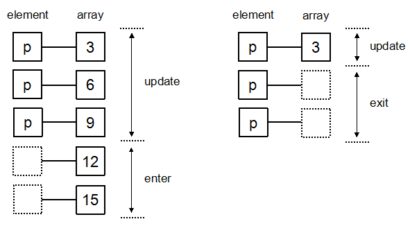

## 一、D3简介

#### D3是什么？

​    D3是一个javascript的函数库，用来做数据数据可视化的。

#### D3的优势

- 数据能够与DOM绑定在一起
- 数据转换和绘制是独立的
- 代码简洁
- 大量布局
- 基于SVG，缩放不会损失精度


 ## 二、WEB前端开发基础

#### 浏览器

D3对IE8及以下版本支持不好，建议使用高版本的浏览器。D3可运行于IE9+、firefox、Chrome、Safari、Opera等浏览器。

#### SVG

指可缩放矢量图形，是用于描述二维矢量图形的一种图形格式。SVG使用XML格式来定义图形，除了IE8之前的版本外，绝大部分浏览器都支持SVG，可将SVG文本直接嵌入HTML中显示。D3十分适合在SVG中绘制图形。

添加一组<svg>标签：

```html
<svg width="300" height="300" version="1.1"></svg>
```

SVG中预定义了七种形状元素，分别为：矩形<rect>、圆形<circle>、椭圆<ellipse>、线段<line>、折线<polyline>、多边形<polygon>、路径<path>。

##### 1. 矩形

矩形的参数有6个。

- x：矩形左上角的X坐标。
- y：矩形左上角的Y坐标。
- width：矩形的宽度。
- height：矩形的高度。
- rx；对于圆角矩形，指定椭圆在X方向的半径。
- ry：对于圆角矩形，指定椭圆在Y方向的半径。

绘制一个直角矩形

```html
<svg xmlns="http://www.w3.org/2000/svg" width="300" height="300" version="1.1">
  <rect x="20" y="20" width="200" height="200" style="fill:steelblue; stroke:blue; stroke-width:4; opacity:0.5"></rect>
</svg>
```

绘制一个圆角矩形

```html
<svg xmlns="http://www.w3.org/2000/svg" width="300" height="300" version="1.1">
    <rect x="20" y="20" rx="20" ry="20" width="200" height="200" style="fill:steelblue; stroke:blue; stroke-width:4; opacity:0.5"></rect>
</svg>
```

代码解释：

- fill：定义矩形的填充颜色（rbg,颜色名或者16进制都可以）

- stroke-width：矩形边框的宽度

- stroke：矩形边框的颜色                 

##### 2. 圆形和椭圆形

圆形的参数是3个。

- cx：圆心的X坐标。
- cy：圆心的Y坐标。
- r：圆的半径。

椭圆的参数与圆形类似，只是半径分为水平半径和垂直半径。

- cx：圆心的X坐标。
- cy：圆心的Y坐标。
- rx：椭圆的水平半径。
- ry：椭圆的垂直半径。

绘制圆形

```html
<svg xmlns="http://www.w3.org/2000/svg" width="300" height="300" version="1.1">
  <circle cx="50" cy="50" r="20" style="fill:yellow; stroke:black; stroke-width:4"></circle>
</svg>
```

绘制椭圆

```html
<svg xmlns="http://www.w3.org/2000/svg" width="300" height="300" version="1.1">
  <ellipse cx="120" cy="100" rx="100" ry="80" style="fill:yellow; stroke:black; stroke-width:4"></ellipse>
</svg>
```
##### 3. 线段

线段的参数是起点和终点的坐标。

- x1：起点的X坐标。
- y1：起点的Y坐标。
- x2：终点的X坐标。
- y2：终点的Y坐标。

绘制线段

```html
<svg xmlns="http://www.w3.org/2000/svg" width="300" height="300" version="1.1">
  <line x1="120" y1="20" x2="100" y2="80" style="fill:yellow; stroke:black; stroke-width:4"></line>
</svg>
```
##### 4. 多边形和折线

多边形和折线的参数是一样的，都只有一个points参数，这个参数的值是一系列的点坐标。不同之处是多边形会将终点和起点连接起来，而折线是不链接。

绘制多边形

```html
<svg xmlns="http://www.w3.org/2000/svg" width="300" height="300" version="1.1">
  <polygon points="100,20 20,90, 60,160 140,160 180,90" style="fill:lawngreen; stroke:black; stroke-width:3"></polygon>
</svg>
```

绘制折线

```html
<svg xmlns="http://www.w3.org/2000/svg" width="300" height="300" version="1.1">
  <polyline points="100,20 20,90, 60,160 140,160 180,90" style="fill:white; stroke:black; stroke-width:3"></polyline>
</svg>
```
##### 5. 路径

<path>标签的功能最丰富，前面举的栗子都可以用路径绘制出来。与折现类似，也是通过给出一系列点坐标来绘制。在D3中绘制地图时，会经常用到此标签。其用法：给出一个坐标点，在坐标点的前面添加一个英文字母，表示如何运动到此坐标点的。

###### 5.1 绘制直线

```html
<svg xmlns="http://www.w3.org/2000/svg" width="600" height="500" version="1.1">
      <path d="M100,100 H500
               M300,100 V500
               M100,500 H500
               M200,200 L100,400
               M150,300 L250,400
               M450,200 L350,400
               M400,300 L500,400"
          style="stroke:black; stroke-width:3" />
    </svg>
```

英文字母按照功能可以分为5类，下面跟着栗子分别介绍。

- 移动类

  M  将画笔移动到指定坐标。

- 直线类

  L  画直线到指定坐标。

  H  画水平直线到指定坐标。

  V  画垂直直线到指定坐标。

猜猜画出来是什么！

###### 5.2 绘制三次贝塞尔曲线 

```html
<svg xmlns="http://www.w3.org/2000/svg" width="600" height="200" version="1.1">
   <path d="M30,100 C100,20 190,20 270,100 S400,180 450,100" style="stroke:green; fill:yellow; stroke-width:3" />
</svg>
```

- 曲线类

  C  画3次贝塞尔曲线经两个指定控制点到达终点坐标。

  S  与前一条三次贝塞尔曲线相连，第一个控制点为前一条曲线第二个控制点的对称点，只需输入第二个控制点和终点，即可绘制一个三次贝塞尔曲线。

C后接三个坐标，分别为两个控制点和终点；S后面接两个坐标，分别为第二个控制点和终点。S会根据之前的曲线自动生成一个控制点。

###### 5.3 绘制二次贝塞尔曲线

```html
<svg xmlns="http://www.w3.org/2000/svg" width="600" height="200" version="1.1">
   <path d="M30,100 Q190,20 270,100 T450,100" style="stroke:green; fill:yellow; stroke-width:3" />
</svg>
```

- 曲线类

  Q  画二次贝塞尔曲线经一个指定控制点到达终点坐标。

  T  与前一条二次贝塞尔曲线相连，控制点为前一条二次贝塞尔曲线控制点的对称点，只需输入终点，即可绘制一个二次贝塞尔曲线。


###### 5.4 绘制弧线

```html
<svg xmlns="http://www.w3.org/2000/svg" width="600" height="400" version="1.1">
   <path d="M100,200 a200,150 0 1,0 150,-150 Z" style="stroke:green; fill:yellow; stroke-width:3" />
</svg>
```

- 弧线类

  A  画椭圆曲线到指定坐标。弧线是根据椭圆来绘制的，参数比较多：

  A(rx（椭圆X方向的半轴大小）,ry（椭圆Y方向的半轴大小）x-axis-rotation（椭圆的X轴与水平轴顺时针方向的夹角）large-arc-flag（有两个值{1：大角度弧线 、0：小角度弧线},sweep-flag（有两个值{1：顺时针至终点、 0：逆时针至终点}）x（终点X坐标）,y（终点Y坐标）） )

- 闭合类

  Z  绘制一条直线连接终点和起点，用来封闭图形。

其中，用了小写a标示相对坐标，当前画笔位置为（100，200），那么终点位置就为（100+150，200-150）=（250，50）。

以上命令用大写字母表示坐标系中的绝对坐标，小写字母写标识相对坐标（相对于当前画笔所在点）。

##### 6. 文字

```html
<svg xmlns="http://www.w3.org/2000/svg" width="500" height="200" version="1.1">
      <text x="200" y="50" dx="-5" dy="5" rotate="180" textLength="70" style="fill:green; font-size:30px;">这是<tspan style="fill:yellow">文字</tspan></text>
</svg>
```

- x：文字位置的X坐标
- y：文字位置的Y坐标
- dx：相对于当前位置在X方向上平移的距离（值为正则往右，负则往左）
- dy：相对于当前位置在Y方向上平移的距离（值为正则往下，负则往上）
- rotate：旋转角度（顺时针为正，逆时针为负）
- textLength：文字的显示长度（不足则拉长，足则压缩）

#####  7. 样式

SVG支持使用CSS选择器给元素定义样式。

- fill：填充色（rbg,颜色名或者16进制都可以）
- stroke：边框的颜色 
- stroke-width：边框的宽度
- stroke-linecap：线头端点的样式，butt、round（圆角）、square（直角）。
- stroke-dasharray：虚线的样式，例如：stroke-dasharray="10,10" stroke-dasharray="15,15" stroke-dasharray="20,10,5,5,5,15"。

##### 8. 标记

标记（marker）是SVG中一个重要的概念，能帖服于<path>、<line>等元素上。标记<marker>写在<defs></defs>中，defs用于定义可重复利用的图形元素。

<marker>标签的属性和意义：

- viewBox：坐标系的区域。
- refX，refY：在viewBox内的基准点，绘制时此点在直线端点上。
- markerUnits：标记大小的基准，有两个值，即strokeWidth（线的宽度）和userSpaceOnUse（线前端的大小）。
- markerWidth，markerHeight：标识的大小。
- orient：绘制方向，可设定为auto（自动确认方向）和角度值。
- id：标识的id号。

这是定位的属性如下：

- marker-start：路径起点处。
- marker-mid：路径中间端点处。
- marker-end：路径终点处。

绘制带原点和箭头的直线

```html
<svg xmlns="http://www.w3.org/2000/svg" width="500" height="200" version="1.1">

      <defs>
        //先定义一个圆点
        <marker id="markerCircle" markerWidth="8" markerHeight="8" refx="5" refy="5">
          <circle cx="5" cy="5" r="3" style="stroke: none; fill:#000000;"/>
        </marker>
        //先定义一个箭头
        <marker id="markerArrow" markerWidth="13" markerHeight="13" refx="2" refy="6" orient="auto">
          <path d="M2,2 L2,11 L10,6 L2,2" style="fill: #000000;" />
        </marker>
      </defs>

      //然后画直线
      <line x1="0" y1="0" x2="100" y2="50"  stroke="red" stroke-width="1" marker-end="url(#markerArrow)"  />
      
      <path d="M100,10 L150,10 L150,60"
          style="stroke: #6666ff; stroke-width: 1px; fill: none;
                 marker-start: url(#markerCircle);
                 marker-mid: url(#markerCircle);
                 marker-end: url(#markerArrow) "
          />
</svg>
```

##### 9. 滤镜

滤镜（filter）能使图形更具有艺术效果。对源图形使用滤镜能修改其显示结果。但是，滤镜不会改变源图形的数学参数，只是将其渲染后传给显示设备。

滤镜的标签为<filter>，和标记<marker>一样，也是在<defs>中定义的。滤镜的种类很多，例如：feMorphology、feGaussianBlur、feFlood等等，还有定义光源的滤镜feDistantLight、fePointLight、feSqotLight，都是以fe开头的。

```html
<svg xmlns="http://www.w3.org/2000/svg" width="500" height="200" version="1.1">
      //先定义一个滤镜
      <defs>
        <filter id="GaussianBlur">
          <feGaussianBlur in="SourceGraphic" stdDeviation="2" />
        </filter>
      </defs>
      //定义一个矩形
      <rect x="300" y="100" width="150" height="100" style="fill:blue; filter:url(#GaussianBlur)" />
</svg>
```

属性说明：

- in是使用滤镜的对象，此处是源图形SourceGraphic。
- stdDeviation是高斯模糊唯一的参数，数值越大，模糊程度越高。

##### 9. 渐变

SVG中有线性渐变<linearGradient>和放射性渐变<radialGradient>。渐变也是定义在<defs>标签中的。

```html
<svg xmlns="http://www.w3.org/2000/svg" width="500" height="200" version="1.1">
        //先定义一个渐变
        <defs>
          <linearGradient id="Gradient" x1="0%" y1="0%" x2="100%" y2="0%">
            <stop offset="0%" stop-color="#F00" />
            <stop offset="100%" stop-color="green" />
          </linearGradient>
        </defs>
        //定义一个矩形
        <rect x="300" y="100" width="150" height="100" style="fill:url(#Gradient)" />
    </svg>
```

x1、y1、x2、y2定义渐变的方向，此处是水平渐变。将x1、y1、x2、y2设置为0%、0%、0%、100%则是垂直渐变。offset定义渐变开始的位置，stop-color定义此位置的颜色。

## 三、安装和使用

D3是一个javascript函数库，所以并不需要安装，它只有一个文件，在HTML中引用即可。

#### 第一个程序

```html
<html> 
  <head> 
        <meta charset="utf-8"> 
        <title>HelloWorld</title> 
  </head> 
    <body> 
        <p>用D3来更改hello world</p>
        <span>1</span>
        <span>2</span>
        <script src="d3.js"></script>
        <script type="text/javascript">
        var span = d3.select('body')
                    .selectAll('span')
                    .text('hello world')

        // 修改标签的颜色和字体大小
        span.style('color','green')
            .style('font-size','30px')
        </script>
    </body> 
</html>
```

上面的代码是先将选中的元素赋值给变量span，然后通过变量span来改变样式，这样使代码更整洁。D3能够连续不断地调用函数（链式语法）。

## 四、选择元素和绑定数据

#### 选择元素

D3中，用于选择元素的函数有两个：

- d3.select()是选择所有指定元素的第一个
- d3.selectAll()是选择指定元素的全部

```javascript
d3.select("body") //选择body元素
d3.select("#box")  //选择id为box的元素
d3.select(".content") //选择类为content的元素
d3.selectAll("p")  //选择所有的p元素
d3.selectAll(".content")  //选择类为content的所有元素
d3.selectAll("ul li") //选择ul中所有的li元素
```

除了CSS选择器，还可以是已经被DOM选择的元素

```javascript
var text = document.getElementById("text")
d3.select(text)
//但是有个问题：如果选择的元素是多个，将其作为select的参数，不能达到选择其中一个元素的效果。
//使用dom选择类为content的元素集
var content = document.getElementsByClassName("content")
d3.select(content)  //不能达到选择第一个元素的效果
d3.selectAll(content)  //正确的方法
```

使用getElementById选择的元素要用select；使用getElementsByClassName选择的元素要用selectAll。但是尽量使用CSS选择器作为参数。

D3支持连续调用函数的方法（链式语法）。for example：d3.select("body").selectAll("p")

#### 选择集

d3.select和d3.selectAll返回的对象称为选择集，添加、删除、设定网页中的元素，都得使用选择集。

##### 1.查看状态

- selection.empty()如果选择集为空，则返回true，如果不为空，返回false
- selection.node()返回第一个非空元素，入股偶选择集为空则返回null
- selection.size()返回选择集中的元素个数


```html
<a>1</a>
<a>2</a>
<a>3</a>

<script type="text/javascript">
  var a = d3.select('body')
  		 .selectAll('a')
  console.log(a.empty())   //false
  console.log(a.node())    //<a>1</a>
  console.log(a.size())    //3
</script>
```

##### 2. 设定和获取属性

- selection.attr('name','value')

  设置或获取选择集的属性，name是属性名，value是属性值，如果省略value，则返回当前属性值。

  ```html
  <div id="addCircle"></div>
  <script type="text/javascript">
    var svg = d3.select('body')
    .select('#addCircle')
    .append('svg')
    .attr('width','300')
    .attr('height','100')

    svg.append('circle')
      .attr('class','circle')
      .attr('cx','50')
      .attr('cy','50')
      .attr('r','20')
      .attr('fill','red')
  </script>
  ```

- slection.classed('name','value')

  设定或获取选择集的CSS类，name是类名，value是一个布尔值。布尔值表示是否开启。当布尔值是true的时候，开启对应的类，元素标签添加class="classname"，当布尔值为false时，标签中不会添加任何属性。

  ```html
  <div id="addCircle"></div>
  <script type="text/javascript">
    var svg = d3.select('body')
    .select('#addCircle')
    .append('svg')
    .attr('width','300')
    .attr('height','100')

    svg.append('circle')
      .attr('cx','50')
      .attr('cy','50')
      .attr('r','20')
      .attr('fill','red')
      .attr('class','name size content')
      .classed('name',true)  //开启name类
      .classed('size',false)  //关闭size类
      .classed({'name':false,'size':true})  //也可以这样写在对象里面
      .classed('size content',false)  //也可以用空格分开写在一起

  </script>
  ```

- selection.style('name','value')

  设定或获取选择集的样式，name是样式名，value是样式值

  ```html
  <h1>my name is h1</h1>
  <script type="text/javascript">
    var svg = d3.select('body')
    .select('h1')
    .style('color','pink')
    .style('font-size','35px')
    .style({"text-decoration":"underline","cursor":"pointer"})
  </script>
  ```

- selection.property('name','value')

  设定或获取选择集的属性，name是属性名，value是属性值。有部分属性，不能用attr()设定和获取，最典型的就是文本输入框的value属性，此属性值不会在不标签中显示。像复选框等，都需要用property()来获取属性。总之，不能用attr()来处理属性的，都可以考虑用property()。

  ```html
  <input type="text" name="fullname" id="inputName" />
  <script type="text/javascript">
    var inputValue = d3.select('body')
    .select('#inputName')
    // .property("value")  //返回值是你输入的值
    .property('value','d3')  //给文本框赋值 d3
  </script>
  ```

- selection.text('name','value')

  设定或获取选择集的文本内容。文本内容相当于DOM的innerText，不包括元素内部的标签。

  ```html
  <p id="pText">薛<span>之</span>谦</p>
  <script type="text/javascript">
    console.log(d3.select('body').select('#pText').text())   
  </script>
  ```

- selection.html(value)

  设定或获取选择集的内部HTML内容，相当于DOM的innerHTML，包括元素内部的标签。

  ```html
  <p id="pText">薛<span>之</span>谦</p>
  <script type="text/javascript">
    console.log(d3.select('body').select('#pText').html())        
  </script>
  ```

####  添加、插入和删除

- selection.append(name)

  在选择集的末尾添加一个元素，name为元素名称。

- selection.insert("name","#before")

  在选择集中的指定元素之前插入一个元素，name是被插入的元素名称，before是CSS选择器名称。

- selection.remove()

  删除选择集中的元素。

```html
<p id="car">car</p>
<p id="plane">plane</p>
<p id="ship">ship</p>
<script type="text/javascript">
  var body = d3.select('body')  //选择body元素
  body.append('p').text('train')  //在body中所有元素的末尾添加一个P标签
  body.insert('p','#car').text('bike')  //在car元素前面添加一个P标签
  var ship = d3.select('#ship')
  .remove()  //删除ship
</script>
```

#### 数据绑定

将数据绑定到DOM上是D3的特色。d3.select和d3.selectAll返回元素的选择集，选择集上是没有数据的。数据绑定，就是使被选择元素里面“含有”数据。相关函数有两个：

- selection.datum(value)选择集中的每一个元素都绑定相同的数据value。
- selection.data(value,key)选择集中的每一个元素分别绑定数组value的每一项。key是一个键函数，用于指定绑定数组时的对应规则。

##### 1. datum()的工作过程

datum()绑定数据的方法很简单，平时可能使用得比较少，但是某些时候还是能派上大用场的。直接上代码：

```html
<p class="num">one</p>
<p class="num">two</p>
<p class="num">three</p>
<script type="text/javascript">
  var num = d3.select('body')
              .selectAll('.num')
  num.datum(666)
  console.log(num)
  console.log(num.datum())  //没有参数 就返回——data——的属性值
</script>
```

接下来我们去打望打望控制台。

SO，datum()的工作过程就是对于选择集中的每一个元素，都增加一个—data—_属性，属性值为datum(value)的value值。如果参数是undefined和null，则不会创建_—data—属性。

用绑定的数据替换原本的段落：

```html
<p class="num1">原创歌手</p>
<p class="num1">段子手</p>
<p class="num1">深情的</p>
<script type="text/javascript">
  var num1 = d3.select('body')
  .selectAll('.num1')

  num1.datum("薛之谦")
    .append('span')
    .text(function(d,i){  //d代表数据 i代表index
    return "——"+d+i+"号"
  })
  console.log(num1)
</script>
```

所以，在被绑定数据的选择集中添加元素后，新元素会继承该数据。

##### 2. data()的工作过程

data()能将数组各项分别绑定到选择集的各元素上，并且能指定绑定的规则。当数组长度与元素数量不一致时，data()也能够处理。当数组长度大于元素数量时，为多余数据预留元素位置，以便将来插入新元素；当数组长度小于元素数量时，能获取多余元素的位置，以遍将来删除。

```html
<p class="num2">演员</p>
<p class="num2">刚刚好</p>
<p class="num2">认真的雪</p>
<script type="text/javascript">
  var num2 = d3.select('body')
  .selectAll('.num2')
  var dataset = ["绅士","初学者","未完成的歌"]
  num2.data(dataset)
  console.log(num2)
</script>
```

上面的数组长度和元素数量刚刚好，下面看看不等的情况。

d3中，根据数组长度和元素数量的关系，分别把各种情况归纳如下：

在读入数据进行可视化的过程中，被读入的数据都要绑定到选择集的元素上，没有绑定数据的元素是没有用的。

- update：数组长度=元素数量。（则绑定数据的元素即将被更新）
- enter：数组长度>元素数量。（则部分还不存在的元素即将进入可视化）
- exit：数组长度<元素数量。（则多余的元素即将退出可视化）



data()返回一个对象，对象里包含update部分，还有两个方法：enter()返回enter部分；一个是exit()返回exit部分。 

```html
<p class="n">演员</p>
<p class="n">刚刚好</p>
<p class="n">认真的雪</p>
<script type="text/javascript">
  var n = d3.select('body')
  .selectAll('.n')
  var dataset = ["《绅士》","《初学者》","《未完成的歌》","《一半》","《意外》"]

  var update = n.data(dataset)
  update.append('span')
    .text(function(d,i){  //d代表数据 i代表index
    return "——"+d
  })
  console.log(update)
  console.log(update.enter())
  console.log(update.exit())
</script>
```

在控制台可以看到，d3已经为多余的数组“《一半》”和"《意外》"预留了位置，以备将来添加元素。enter部分仲，还有一个变量update，指向update部分。因为本次绑定中，没有多余的元素，所以exit部分没有内容。

##### 3. 选择集的处理

- enter的处理方法

如果没有足够的元素，那么就添加元素。所以，通常从服务器读取数据后，网页中是没有与之对应的元素的。因此，有一个很常见的用法：选择一个空集，然后使用enter().append()的形式来添加足够数量的元素。

```html
<script type="text/javascript">
  var dataset2 = [10,20,30,40,50,60]
  var body = d3.select('body')
  body.selectAll('b')  //选择了一个空集
    .data(dataset2)  //绑定数据
    .enter()  //返回enter部分
    .append('p')  //添加li标签
    .text(function(d){
    return d
  })
</script>
```

- exit的处理方法

如果存在多余的元素，那就删除元素。使用remove()就可以删除元素。

```html
<div id="boxs">
  <p></p>
  <p></p>
  <p></p>
  <p></p>
  <p></p>
</div>
<script type="text/javascript">
  var dataset2 = [10,20,30]
  var body = d3.select('body')
  body.select('#boxs')  
    .selectAll('p')
    .data(dataset2)  //绑定数据
    .text(function(d){
    return d
  })
    .exit()  //返回exit部分
    .remove()  //删除多余的2个P标签
</script>
```

此处省略“处理模板、过略器、选择集的顺序、each()的应用、call()的应用。

#### 柱形的制作（见详细代码）

```html
<!DOCTYPE html>
<html lang="en">
  <head>
    <meta charset="UTF-8">
    <title>柱形图的制作</title>
    <script src="d3.js"></script>
  </head>
  <body>
    <script type="text/javascript">
      //首先绘制SVG
      var width = 600
      var height = 200
      var svg = d3.select('body')
      .append('svg')
      .attr('width',width)  //设置svg的属性
      .attr('height',height)
      //然后定义3个变量
      //定义上下左右的边距
      var padding = {
        top: 20,
        right: 20,
        bottom: 20,
        left: 20
      }
      //矩形所占的宽度（包括空白）
      var rectStep = 35
      //矩形所占的宽度（不包括空白）
      var rectWidth = 30

      //定义数据
      var dataset = [60,40,120,88,22,150,60,55]
      //添加矩形
      svg.selectAll('rect')
        .data(dataset)
        .enter()
        .append('rect')
        .attr("x",function(d,i){  //设置矩形的X坐标
        return padding.left + i * rectStep
      })
        .attr('y',function(d,i){  //设置矩形的Y坐标
        return height - padding.bottom - d
      })
        .attr('width',rectWidth)  //设置每个矩形的宽度
        .attr('height',function(d,i){  //设置每个矩形的高度
        return d
      })
        .style({"fill":"yellow","stroke":"green","stroke-width":'3'})

      //给矩形添加文字
      var text = svg.selectAll('text')
      .data(dataset)
      .enter()
      .append('text')
      .style({"fill":"#000","font-size":"18px","text-anchor":"middle"})
      .attr('x',function(d,i){
        return padding.left + i * rectStep
      })
      .attr('y',function(d){
        return height - padding.bottom - d
      })
      .attr('dx',rectWidth/2)
      .attr('dy','20')
      .text(function(d){
        return d
      })


    </script>
  </body>

</html>
```


## 五、比例尺和坐标轴

#### 比例尺

##### 1. 为什么需要比例尺？

上面制作了一个柱状图，绘图时，直接使用150给矩形的高度赋值，即矩形的宽度就是250个像素。所以，如果过数值过大或者过小，就会造成太小看不到，太大没有这么大的画布来画。

SO，我们需要一种计算关系，能够将：某一区域的值映射到另一区域，其大小关系不变。这就是比例尺。

##### 2. 有哪些比例尺？

比例尺，很像数学中的函数。例如，对于一个一元二次函数（y=2x+1），有 x 和 y 两个未知数，当 x 的值确定时，y 的值也就确定了。

在数学中，x 的范围被称为**定义域**，y 的范围被称为**值域**。

D3 中的比例尺，也有定义域和值域，分别被称为 domain 和 range。开发者需要指定 domain 和 range 的范围，如此即可得到一个计算关系。

D3 提供了多种比例尺，下面介绍最常用的两种。

- 线性比例尺

线性比例尺，能将一个连续的区间，映射到另一区间。要解决柱形图宽度的问题，就需要线性比例尺。

假设有以下数组：

```javascript
var dataset = [1.2, 2.3, 0.9, 1.5, 3.3]
```

现有要求如下：

将dataset中最小的值，映射成0；将最大的值，映射成300。

```javascript
var min = d3.min(dataset)
var max = d3.max(dataset)
var linear = d3.scale.linear()
               .domain([min,max])
               .range([0,300])
linear(0.9)  //返回0
linear(2.3)  //返回175
linear(3.3)  //返回300
```

其中，d3.scale.linear() 返回一个线性比例尺。domain() 和 range() 分别设定比例尺的定义域和值域。在这里还用到了两个函数，它们经常与比例尺一起出现：d3.max() 求数组的最大值；d3.min() 求数组最小值

注意：d3.scale.linear() 的返回值，是可以当做函数来使用的。因此，才有这样的用法：linear(0.9)。

- 序数比例尺

有时候，定义域和值域不一定是连续的。例如：

```javascript
var index = [0,1,2,3,4]
var color = ["red","blue","green","yellow","black"]
```

我们希望0对应颜色red，1对应blue.....

但是，这些值都是散离的，线性比例尺不适合，需要用到序数比例尺。

```javascript
var ordinal = d3.scale.ordinal()
                .domain(index)
                .range(color)
ordinal(0)  //返回red
ordinal(2)  //返回green
ordinal(4)  //返回black
```

##### 3.给柱形图添加比例尺（见详细代码）

#### 坐标轴

##### 1. 坐标轴由什么构成

坐标轴在 SVG 中是没有现成的图形元素的，需要用其他的元素组合构成。D3 提供了坐标轴的组件，如此在 SVG 画布中绘制坐标轴变得像添加一个普通元素一样简单。最终使其变为类似以下的形式：

```html
<g>
<!-- 第一个刻度 -->
<g>
<line></line>   <!-- 第一个刻度的直线 -->
<text></text>   <!-- 第一个刻度的文字 -->
</g>
<!-- 第二个刻度 -->
<g>
<line></line>   <!-- 第二个刻度的直线 -->
<text></text>   <!-- 第二个刻度的文字 -->
</g> 
...
<!-- 坐标轴的轴线 -->
<path></path>
</g>
```

<g>标签是用于把相关元素进行组合的容器元素。如果需要手动添加这些元素就太麻烦了，为此，D3 提供了一个组件：d3.svg.axis()。

##### 2. 定义坐标轴

要生成坐标轴，需要用到比例尺，它们二者经常是一起使用的。

```javascript
//数据
var dataset = [ 2.5 , 2.1 , 1.7 , 1.3 , 0.9 ];
//定义比例尺
var linear = d3.scale.linear()
      .domain([0, d3.max(dataset)])
      .range([0, 250]);

var axis = d3.svg.axis() //D3 中坐标轴的组件，能够在 SVG 中生成组成坐标轴的元素
     .scale(linear)      //指定比例尺
     .orient("bottom")   //指定刻度的方向 bottom 表示在坐标轴的下方显示
     .ticks(7);          //指定刻度的数量
```

##### 3. 在SVG中添加坐标轴

定义了坐标轴之后，只需要在 SVG 中添加一个分组元素 ，再将坐标轴的其他元素添加到这个 里即可。代码如下：

```javascript
svg.append("g").call(axis)
```

上面有一个 **call()** 函数，其参数是前面定义的坐标轴 axis。

在 D3 中，call() 的参数是一个函数。调用之后，将当前的选择集作为参数传递给此函数。也就是说，以下两段代码是相等的。

```javascript
function foo(selection) {
  selection.attr("name1", "value1")
      .attr("name2", "value2")
}
foo(d3.selectAll("div"))
//上面的代码等于
d3.selectAll("div").call(foo)
```

所以，

```javascript
svg.append("g").call(axis)
//等于
axis(svg.append(g))
```

##### 4. 设置坐标轴的样式和位置

```html
<style>
.axis path,
.axis line{
    fill: none;
    stroke: black;
    shape-rendering: crispEdges;
}

.axis text {
    font-family: sans-serif;
    font-size: 11px;
}
</style>
```

分别定义了类 axis 下的 path、line、text 元素的样式。接下来，只需要将坐标轴的类设定为 axis 即可。坐标轴的位置，可以通过 transform 属性来设定。通常在添加元素的时候就一并设定，写成如下形式：

```javascript
svg.append("g")
  .attr("class","axis")
  .attr("transform","translate(20,130)")
  .call(axis)
```

